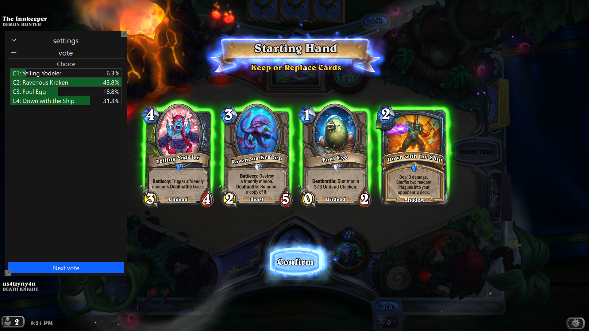

# About

"Chat plays HS" is an overlay, that allows streamers (currently only on Twitch) become the ultimate 
victims of chat backseating.

# Demo




## Twitch bot


# Setup

Find the latest release, and unzip it somewhere (the contents should be all laying as they are in the .zip file).

## PowerLog

TL;DR: Press the big blue button `Enable Power Log` in the `settings` tab.

This app works using the logs from HS itself, like any deck tracker out there
(currently only with standard installation paths).
So it needs some options to be turned on *before* the game starts.

## Setting up Twitch Client

Go [Here](https://twitchtokengenerator.com/) and generate the `ACCESS TOKEN` with bot priveleges.

Add the contents of `ACCESS TOKEN` to the `secrets.toml` file that is bundled with the release.

Before:
```toml
TWITCH_ACCESS_TOKEN = '...'
```

After:
```toml
TWITCH_ACCESS_TOKEN = 'xxxxxxxxxxxxxxxxxxxxxxxxxxxxxx'
```

In the UI itself, go to the `settings` tab, put url of your channel in the box and press `Connect`.

# Back to setup

Currently that's it, click around and, I hope you would understand whats happening in the UI.

Start playing the game, press `Start vote` button and see what's happening from there!

# For advanced users

If you have innate fear of binaries, or want to start it up on your own, then you should have these installed:
- python version>=11
- pip
- venv

## Setup

in the repo root

- initialize virtual env (recommended!)
```shell
python -m venv venv
.\venv\Scripts\activate
```
- install dependencies
```shell
pip install -r requirements.txt
```

## Startup

- run app
```shell
python -m cph.app.main
```

## debug and tools

- debug ui
```shell
python -m cph.app.main_ui
```

- debug qrc
```shell
python -m cph.tests.app.debug_resources
```

- run tests
```shell
python -m pytest tests
```

- update card collection
```shell
python -m cph.cli.download_card_names
```

- and some other cli utils
```shell
python -m cph.cli.name_of_script
```

## Distribution

```shell
pyinstaller .\chat_plays_hs.spec
```
